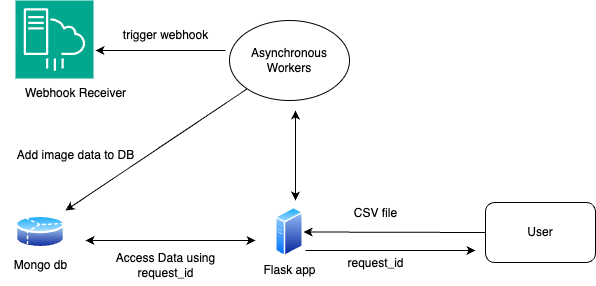

# Low-Level Design Document

## 1. Overview
This document provides the low-level design details of the image processing application. The system processes images from URLs specified in a CSV file, compresses them, stores results in MongoDB, and triggers a webhook upon completion.

## 2. System Architecture

### 2.1 Architecture Diagram

  
*Figure 1: System Architecture Diagram*

### Components:
- **Flask Application**: Handles API requests, processes images, and manages the flow of data.
- **MongoDB**: Stores request statuses, image processing results, and output URLs.
- **Asynchronous Workers**: Manages image processing tasks using Python's ThreadPoolExecutor.
- **Webhook**: Notifies external systems upon completion of processing.

## 3. Components and Interactions

### 3.1 Flask Application
- **Purpose**: Handles API requests, manages data flow, and coordinates processing tasks.
- **Key Endpoints**:
  - `/upload`: Accepts CSV files, starts image processing, and optionally triggers a webhook.
  - `/status/<request_id>`: Retrieves the status of a specific request.
  - `/webhook`: Receives notifications upon processing completion.

### 3.2 MongoDB
- **Purpose**: Stores metadata related to processing requests, including statuses and results.
- **Collections**:
  - **requests**:
    - `request_id`: Unique identifier for each request.
    - `status`: Current processing status (e.g., Pending, Processing, Completed).
    - `images`: Dictionary of image URLs with processing status and paths.
    - `output_csv`: Path to the output CSV file.

### 3.3 Asynchronous Workers
- **Purpose**: Executes image processing tasks in parallel using a thread pool.
- **Implementation**:
  - **ThreadPoolExecutor**: Manages a pool of threads to handle concurrent image processing.
  - **Task Flow**:
    1. Read image URLs from the CSV.
    2. Compress each image.
    3. Store results and update statuses in MongoDB.
    4. Notify via webhook upon completion.

### 3.4 Webhook
- **Purpose**: Sends a notification to a specified URL upon completion of processing.
- **Trigger Point**: After all images are processed and the output CSV is created.
- **Payload**: JSON data including `request_id`, status, and output details.

## 4. Database
- **Database**: `image_processor`
- **Collection**: `requests`
  - **Fields**:
    - `_id`: Auto-generated by MongoDB.
    - `request_id` (string): Unique identifier for the request.
    - `status` (string): Status of the processing (e.g., Pending, Processing, Completed).
    - `images` (object): Dictionary containing URLs, processing status, and paths.
    - `output_csv` (string): Path to the output CSV file.

## 5. API Design

### 5.1 Upload Endpoint (`/upload`)
- **Method**: `POST`
- **Parameters**:
  - `file` (CSV): Contains image URLs.
  - `webhook_url` (string, optional): URL to receive notifications upon completion.
- **Response**:
  - `202 Accepted`: Returns a JSON object with `request_id`.

### 5.2 Status Endpoint (`/status/<request_id>`)
- **Method**: `GET`
- **Parameters**:
  - `request_id` (string): Unique identifier for the request.
- **Response**:
  - `200 OK`: Returns current status and processing details.
  - `404 Not Found`: If the `request_id` is invalid.

### 5.3 Webhook Receiver (`/webhook`)
- **Method**: `POST`
- **Purpose**: Receives notifications after processing is completed.
- **Request Body**:
  - JSON payload with processing details.

### Flow:
1. User uploads CSV via `/upload`.
2. Flask initiates processing using asynchronous workers.
3. Images are compressed and saved locally.
4. Status updates are stored in MongoDB.
5. Upon completion, the webhook is triggered.

